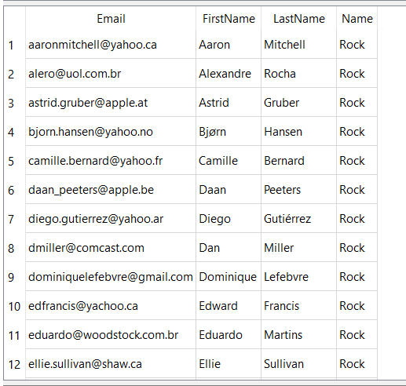
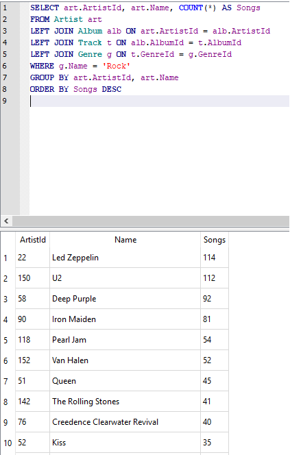
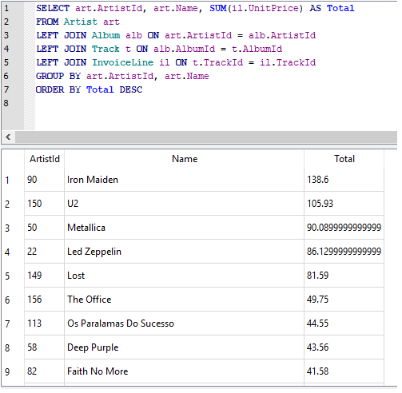
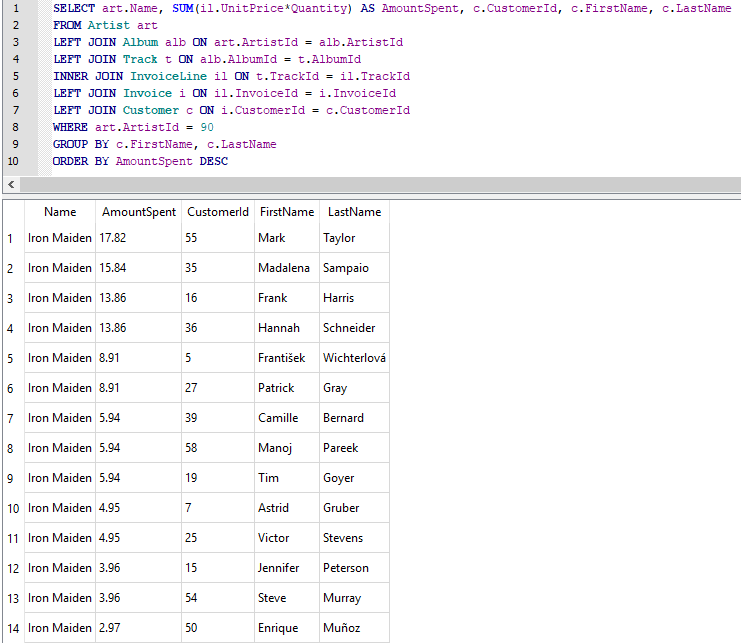

# Data Science 2 - Projeto 1: SQL

## ERD


## Conjunto 1

### Pergunta 1: Quais países possuem mais faturas?

Use a tabela Invoice (Fatura) para determinar quais países possuem mais faturas. Forneça as tabelas de BillingCountry (país de cobrança) e Invoices (faturas) ordenadas pelo número de faturas para cada país.    
O país com mais faturas deve aparecer primeiro.   

```sql
SELECT BillingCountry, COUNT(*) Invoices 
FROM Invoice
GROUP BY BillingCountry
ORDER BY Invoices DESC
```


### Pergunta 2: Qual cidade tem os melhores clientes?

Gostaríamos de lançar um festival de música promocional na cidade que nos gerou mais dinheiro. Escreva uma consulta que retorna a cidade que possui a maior soma dos totais de fatura. Retorne tanto o nome da cidade quanto a soma de todos os totais de fatura.

```sql
SELECT BillingCity, SUM(Total) Quantia
FROM Invoice
GROUP BY BillingCity
ORDER BY Quantia DESC
```


### Pergunta 3: Quem é o melhor cliente?

O cliente que gastou mais dinheiro será declarado o melhor cliente. Crie uma consulta que retorna a pessoa que mais gastou dinheiro. Eu encontrei a solução linkando as três seguintes tabelas: Invoice (fatura), InvoiceLine (linha de faturamento) e Customer (cliente), para recuperar essa informação, mas você probabelmente consegue fazê-lo com menos!

```sql
SELECT c.CustomerId, SUM(Total) Total
FROM Customer c
LEFT JOIN Invoice i ON c.CustomerId = i.CustomerId
GROUP BY c.CustomerId 
ORDER BY Total DESC	
```


## Conjunto 2

### Pergunta 1
Use sua consulta para retornar o e-mail, nome, sobrenome e gênero de todos os ouvintes de Rock. Retorne sua lista ordenada alfabeticamente por endereço de e-mail, começando por A. Você consegue encontrar um jeito de lidar com e-mails duplicados para que ninguém receba vários e-mails?   

Eu escolhi linkar as informações das tabelas Customer (cliente), Invoice (fatura), InvoiceLine (linha de faturamento), Track (música) e Genre (gênero), mas você pode encontrar outra forma de obter a informação.   

```sql
SELECT DISTINCT c.Email, c.FirstName, c.LastName, g.Name
FROM Customer c
LEFT JOIN Invoice i ON c.CustomerId = i.CustomerId
LEFT JOIN InvoiceLine il ON i.InvoiceId = il.InvoiceId
LEFT JOIN Track t ON il.TrackId = t.TrackId
LEFT JOIN Genre g ON t.GenreId = g.GenreId
WHERE g.Name = 'Rock'
ORDER BY c.Email
```



### Pergunta 2

Quem está escrevendo as músicas de rock?   

Agora que sabemos que nossos clientes amam rock, podemos decidir quais músicos convidar para tocar no show.   

Vamos convidar os artistas que mais escreveram as músicas de rock em nosso banco de dados. Escreva uma consulta que retorna o nome do Artist (artista) e a contagem total de músicas das dez melhores bandas de rock.    

Você precisará usar as tabelas Genre (gênero), Track (música) , Album (álbum), and Artist (artista).    

```sql
SELECT art.ArtistId, art.Name, COUNT(*) AS Songs
FROM Artist art
LEFT JOIN Album alb ON art.ArtistId = alb.ArtistId
LEFT JOIN Track t ON alb.AlbumId = t.AlbumId
LEFT JOIN Genre g ON t.GenreId = g.GenreId
WHERE g.Name = 'Rock'
GROUP BY art.ArtistId, art.Name
ORDER BY Songs DESC
```

    


### Pergunta 3

Primeiro, descubra qual artista ganhou mais de acordo com InvoiceLines (linhas de faturamento)?    


```sql
SELECT art.ArtistId, art.Name, SUM(il.UnitPrice) AS Total
FROM Artist art
LEFT JOIN Album alb ON art.ArtistId = alb.ArtistId
LEFT JOIN Track t ON alb.AlbumId = t.AlbumId
LEFT JOIN InvoiceLine il ON t.TrackId = il.TrackId
GROUP BY art.ArtistId, art.Name
ORDER BY Total DESC
```




Agora use este artista para encontrar qual cliente gastou mais com este artista.    

Para essa consulta, você precisará usar as tabelas Invoice (fatura), InvoiceLine (linha de faturamento), Track (música), Customer (cliente), Album (álbum) e Artist (artista).    

Observe que essa é complicada porque a quantia Total gasta na tabela Invoice (fatura) pode não ser em um só produto, então você precisa usar a tabela InvoiceLine (linha de faturamento) para descobrir quanto de cada produto foi comprado e, então, multiplicar isso pelo preço de cada artista.

```sql
SELECT art.Name, SUM(il.UnitPrice*Quantity) AS AmountSpent, c.CustomerId, c.FirstName, c.LastName
FROM Artist art
LEFT JOIN Album alb ON art.ArtistId = alb.ArtistId
LEFT JOIN Track t ON alb.AlbumId = t.AlbumId
INNER JOIN InvoiceLine il ON t.TrackId = il.TrackId
LEFT JOIN Invoice i ON il.InvoiceId = i.InvoiceId
LEFT JOIN Customer c ON i.CustomerId = c.CustomerId
WHERE art.ArtistId = 90
GROUP BY c.FirstName, c.LastName
ORDER BY AmountSpent DESC
```




