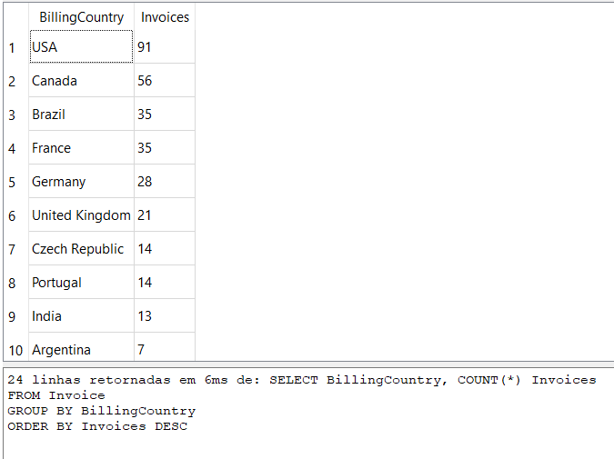
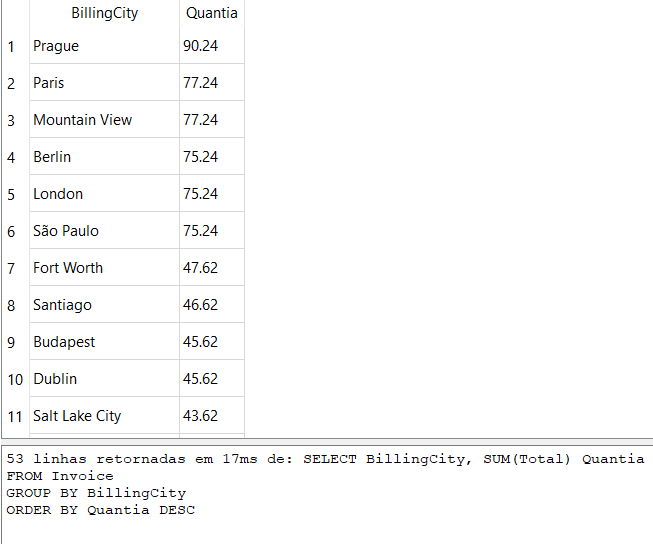
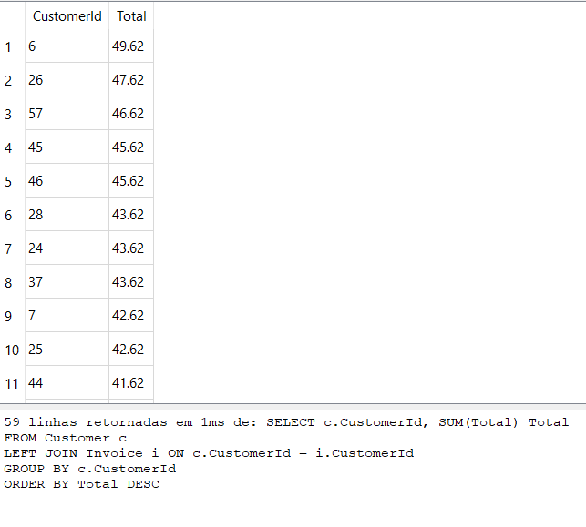

# Data Science 2 - Projeto 1: SQL

## ERD


## Conjunto 1

### Pergunta 1: Quais países possuem mais faturas?

Use a tabela Invoice (Fatura) para determinar quais países possuem mais faturas. Forneça as tabelas de BillingCountry (país de cobrança) e Invoices (faturas) ordenadas pelo número de faturas para cada país.    
O país com mais faturas deve aparecer primeiro.   

```sql
SELECT BillingCountry, COUNT(*) Invoices 
FROM Invoice
GROUP BY BillingCountry
ORDER BY Invoices DESC
```



### Pergunta 2: Qual cidade tem os melhores clientes?

Gostaríamos de lançar um festival de música promocional na cidade que nos gerou mais dinheiro. Escreva uma consulta que retorna a cidade que possui a maior soma dos totais de fatura. Retorne tanto o nome da cidade quanto a soma de todos os totais de fatura.

```sql
SELECT BillingCity, SUM(Total) Quantia
FROM Invoice
GROUP BY BillingCity
ORDER BY Quantia DESC
```



### Pergunta 3: Quem é o melhor cliente?

O cliente que gastou mais dinheiro será declarado o melhor cliente. Crie uma consulta que retorna a pessoa que mais gastou dinheiro. Eu encontrei a solução linkando as três seguintes tabelas: Invoice (fatura), InvoiceLine (linha de faturamento) e Customer (cliente), para recuperar essa informação, mas você probabelmente consegue fazê-lo com menos!

```sql
SELECT c.CustomerId, SUM(Total) Total
FROM Customer c
LEFT JOIN Invoice i ON c.CustomerId = i.CustomerId
GROUP BY c.CustomerId 
ORDER BY Total DESC	
```

